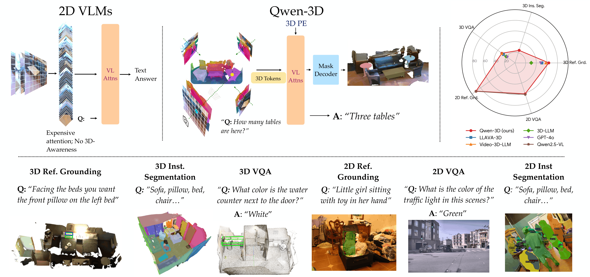

 
<h3>Qwen-3D: A Generalist 3D Vision-Language Model for Spatial Understanding</h3>

 
 

[Lucy Lin](https://github.com/ll220)*1&nbsp;
[Ayush Jain](https://ayushjain1144.github.io/)*1&nbsp;
[Yifan Liu](https://liuyifan22.github.io/)1,2&nbsp;
[Katerina Fragkiadaki](https://www.cs.cmu.edu/~katef/)1&nbsp;
 

1 Carnegie Mellon University&nbsp;
2 Tsinghua University&nbsp;

Arxiv and webpage coming soon...

## Project Updates

## Hugging Face models

Coming soon...

## Getting Started

To install the dependencies, see [docs/INSTALL.md](docs/INSTALL.md).

### Checkpoints

Coming soon...

### Training and Evaluation

See [docs/RUN.md](docs/RUN.md) for training and evaluation commands.

### General Usage 

- Modify `DETECTRON2_DATASETS` to the path where you store the Posed RGB-D data. You might also need to change 3D Mesh point cloud paths (like `SCANNET_DATA_DIR`) for each script. You may want to find these variables in `qwen3d/config.py` and permanently modify these paths.
- If you want to finetune a model with pretrained weights, use MODEL.WEIGHTS to point to these weights. We will provide a link to download Qwen3D pre-trained weights when they are available. You would also need to add `--eval-only` flag for running evaluation. 
- `SOLVER.IMS_PER_BATCH` controls the batch size. This is effective batch size i.e. if you are running on 2 GPUs and the batch size is set to 6, you are using bs=3 per GPU. 
- `SOLVER.TEST_IMS_PER_BATCH` controls the (effective) test batch size. Since, there are variable number of images in a scene, we use bs=1 per GPU at test time. `MAX_FRAME_NUM=-1` means that it loads all images in a scene for inference, which is our usual strategy. In some datasets, the images can simply be too large, thus there we actually set a maximum limit on images. 
- `INPUT.SAMPLING_FRAME_NUM` controls the number of images we sample at test time -- for eg. in ScanNet, we train on 25 image chunks at training time. 
- `CHECKPOINT_PERIOD` is the number of iterations after which a checkpoint is saved. `EVAL_PERIOD` specifies the number of steps after which the eval is run. 
- `OUTPUT_DIR` stores the checkpoints and the tensorboard logs. `--resume` resumes the training from the last checkpoint stored in `OUTPUT_DIR`. If no checkpoint is present, it loads the weights from `MODEL.WEIGHTS`
- The `DATASETS.TRAIN` and `DATASETS.TEST` flags control the datasets in the training and evaluation set. Check [docs/RUN.md](docs/RUN.md) for scripts with various combinations of training sets and the flags associated with them. 
- `BS`, `BS2D`, `BS3D`, and `BBS` all control the batch sizes with various training setups. We train with `batch_size=1` due to memory constraints - the current model forward will not accept different batch sizes. We are looking to fix this later. 

## Citation

Coming soon...

## Credits

- [3D Diffuser Actor](https://github.com/nickgkan/3d_diffuser_actor)
- [UniVLG](https://github.com/facebookresearch/univlg)
- [Mask2Former](https://github.com/facebookresearch/Mask2Former)
- [ODIN](https://github.com/ayushjain1144/odin)

